# Azure Active Directory Lab Deployment with Terraform

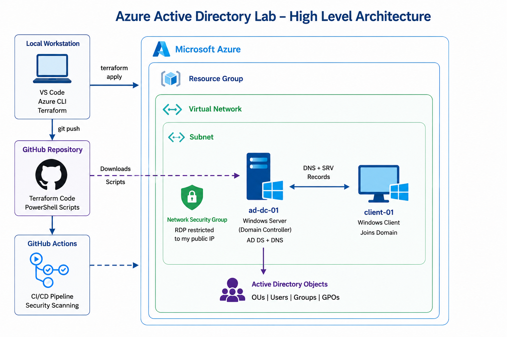
---

# Overview

This project automates the deployment of a Windows Active Directory lab environment in Microsoft Azure using Terraform, PowerShell, and GitHub-hosted automation scripts.

The environment provisions:

* A Windows Server Domain Controller
* A Windows client workstation
* Active Directory Domain Services (AD DS)
* DNS configuration
* Organizational Units (OUs)
* Security Groups
* Active Directory Users
* Group Policy Objects (GPOs)
* Automated domain join orchestration

The project was designed to simulate enterprise-style infrastructure deployment and automation workflows while demonstrating Infrastructure as Code (IaC), cloud engineering, identity management, and troubleshooting concepts.

---

# Technologies Used

* Microsoft Azure
* Terraform
* PowerShell
* Active Directory Domain Services (AD DS)
* Azure Virtual Machines
* Azure Networking
* GitHub
* GitHub Actions
* Azure VM Extensions

---

# Project Goals

This lab was built to:

* Practice Infrastructure as Code (IaC) using Terraform
* Automate Active Directory deployments in Azure
* Simulate enterprise identity infrastructure
* Demonstrate PowerShell automation
* Implement automated domain joins
* Gain experience troubleshooting DNS and AD orchestration issues
* Build a portfolio-ready cloud engineering project

---

# Resources Deployed

* Azure Resource Group
* Virtual Network
* Subnet
* Network Security Group
* Domain Controller VM
* Client Workstation VM
* Public IP Addresses
* Network Interfaces
* Active Directory Domain Services
* DNS Services
* Group Policy Objects

---

# Automated Configuration

## Domain Controller Automation

The Domain Controller deployment automatically:

* Installs AD DS
* Promotes the server to a Domain Controller
* Configures DNS
* Creates Organizational Units
* Creates Security Groups
* Creates Active Directory users
* Applies Group Policy configurations

---

## Client Workstation Automation

The client workstation automation:

* Waits for AD DNS and SRV records
* Validates domain availability
* Automatically joins the domain
* Supports retry-safe deployment logic

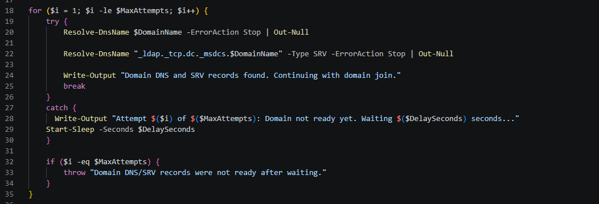

---

# Example Active Directory Structure

## Organizational Units

* IT
* Finance
* HR
* Sales
* Workstations

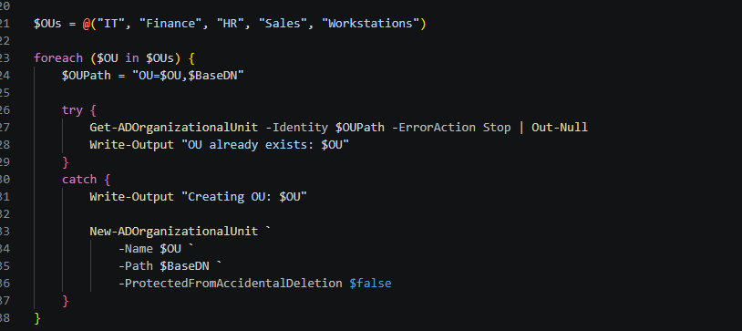

---

## Security Groups

* IT_Admins
* Finance_Users
* HR_Users
* Sales_Users

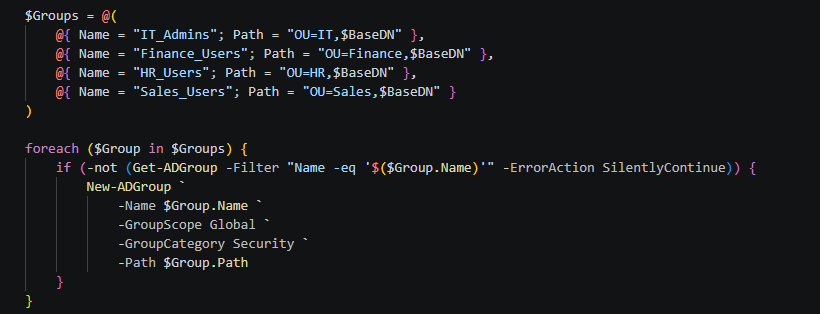

---

## Example Users

* steven.lucas
* sarah.johnson
* michael.lee
* jessica.brown

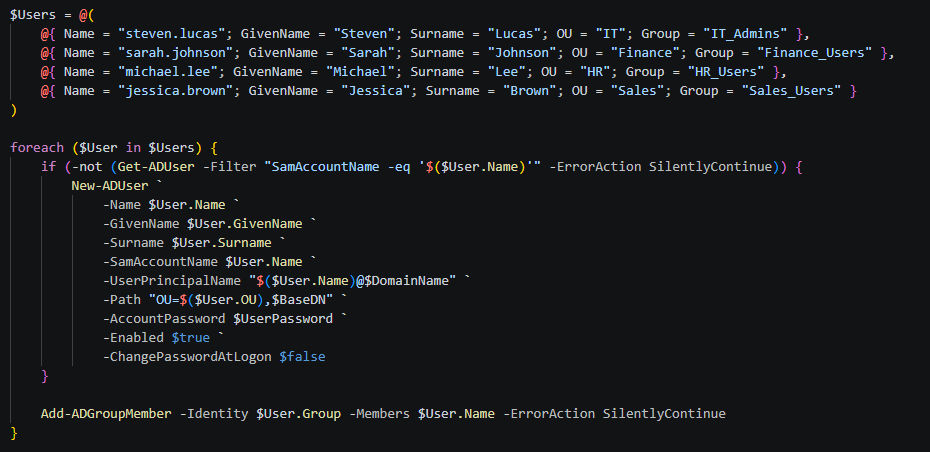

---

# Deployment Steps

## Prerequisites

* Microsoft Azure subscription
* Terraform installed
* Azure CLI installed
* Git installed
* VS Code (recommended)

---

## Clone the Repository

```bash
git clone https://github.com/sglucas21/azure-ad-terraform-lab.git
cd azure-ad-terraform-lab
```

---

## Authenticate to Azure

```bash
az login
```

---

## Initialize Terraform

```bash
terraform init
```

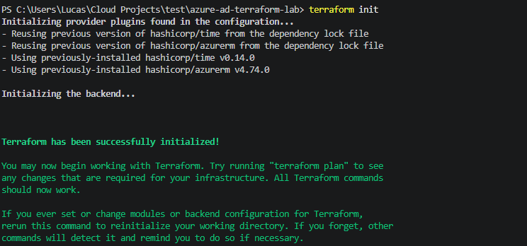

---

## Review the Deployment Plan

```bash
terraform plan
```
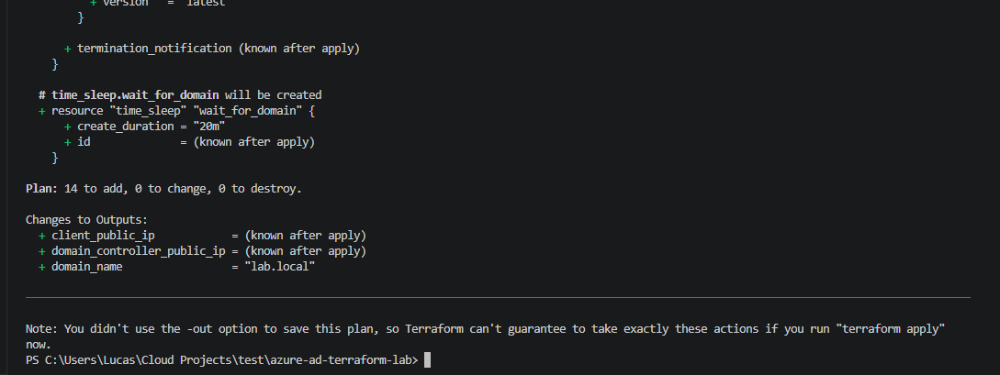

---

## Deploy the Environment

```bash
terraform apply
```
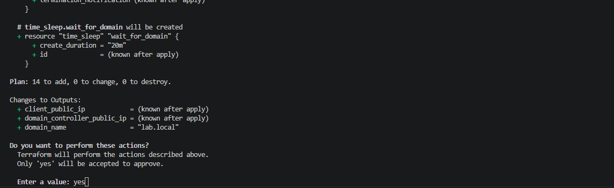

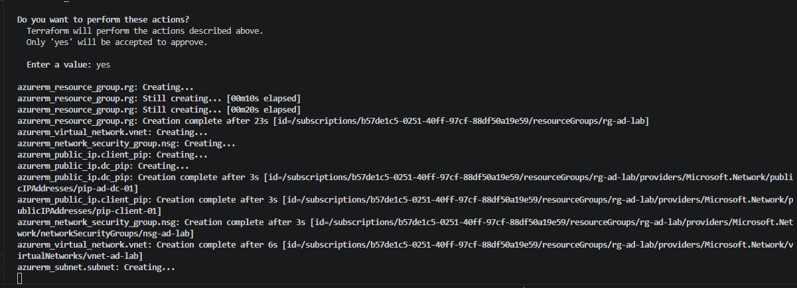

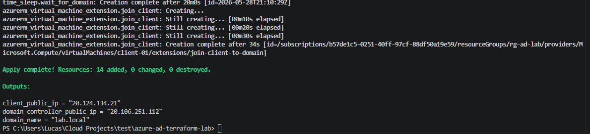

---

## Verify Deployment

After deployment:

* Confirm successful creation and deployment of resources in Azure portal

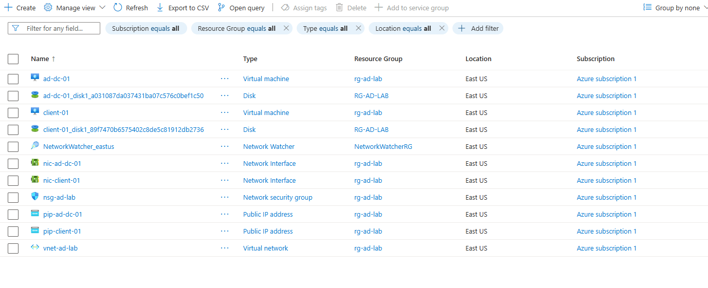

* Confirm the Domain Controller VM is running

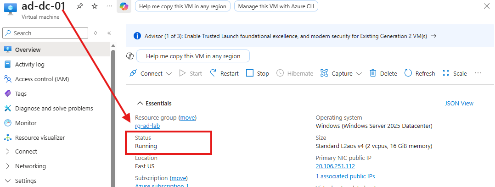

* Confirm the client VM successfully joined the domain

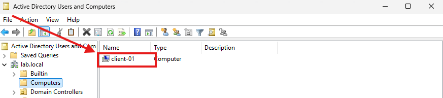

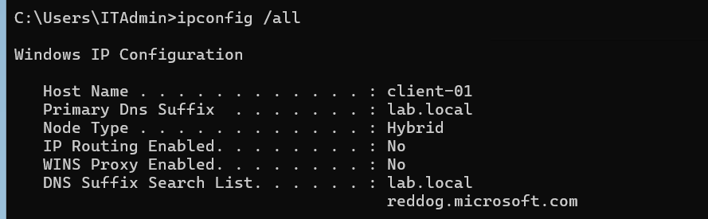

* Verify Active Directory users, groups, and OUs were created

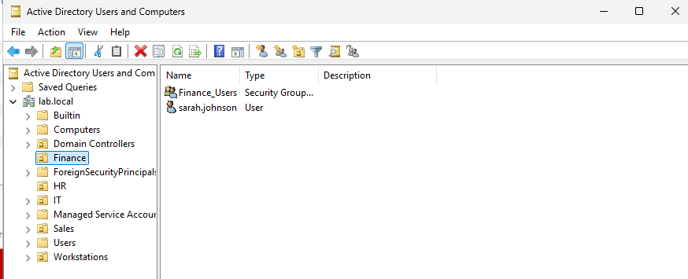

Example verification commands:

```powershell
Get-ADUser -Filter *
```
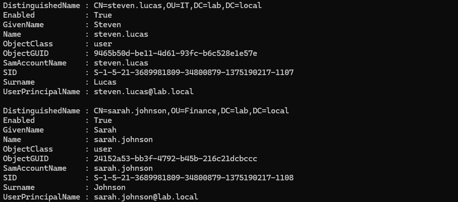

```powershell
Get-ADGroup -Filter *
```

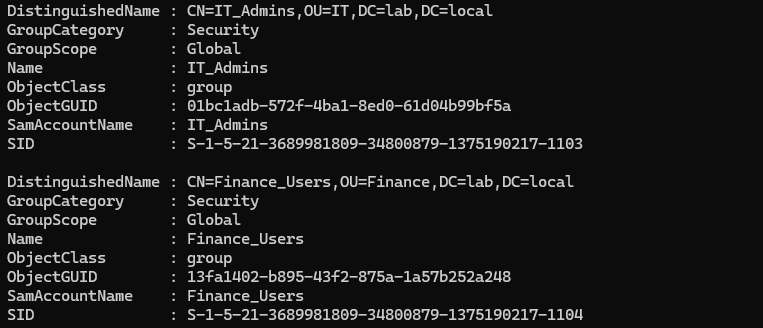
```powershell
Get-ADOrganizationalUnit -Filter *
```

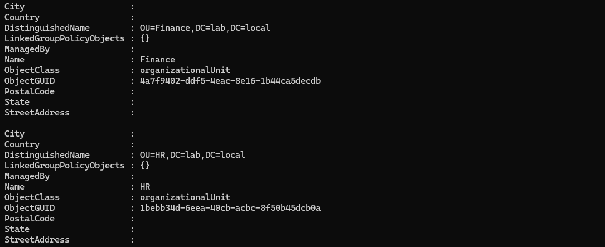

---

## Destroy the Environment

```bash
terraform destroy
```
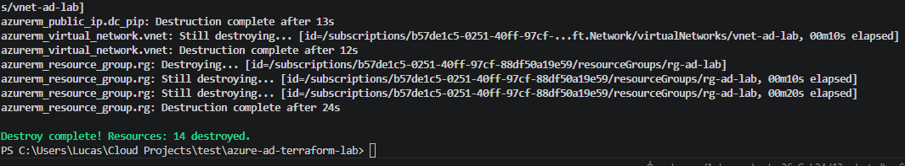
---

# CI/CD Workflow

A GitHub Actions workflow is included to demonstrate how the deployment can be integrated into a CI/CD pipeline.

Current workflow stages include:

* Terraform format validation
* Terraform initialization
* Terraform validation
* Terraform plan
* Security scanning with Checkov and Trivy

Terraform deployments were primarily tested locally using Azure CLI authentication and a local `terraform.tfvars` file excluded from version control.

Future revisions may include:

* GitHub Actions automated deployments
* Azure federated identity authentication
* Azure Key Vault integration
* Remote Terraform state storage
* Modular Terraform architecture

---

# Security Considerations

Sensitive values such as:

* administrator passwords
* DSRM credentials
* public IP restrictions

are excluded from version control using:

* `.gitignore`
* `terraform.tfvars`

A placeholder `terraform.tfvars.example` file is included for reference.

---

# Known Issues & Troubleshooting

## Azure VM SKU Availability

Some Azure VM sizes may not be available in certain regions during deployment.

Example error:

```text
SkuNotAvailable
```

Resolution:

* Change the VM size
* Change Azure region
* Retry deployment later

---

## DNS Initialization Timing

The client workstation may attempt to join the domain before DNS and SRV records are fully available.

Resolution:

* Added retry-safe PowerShell logic
* Added DNS/SRV validation checks before domain join

---

## VM Extension Failures

Azure Custom Script Extensions may fail if:

* scripts are too long
* scripts are unavailable
* DNS resolution is not ready
* GitHub raw URLs are inaccessible

Resolution:

* Hosted scripts directly in GitHub
* Simplified PowerShell orchestration
* Added retry-safe deployment logic

---

## Terraform State Issues

If Azure resources are manually deleted outside Terraform, state mismatches can occur.

Resolution:

```bash
terraform refresh
```

or:

```bash
terraform destroy
terraform apply
```

---

# Future Improvements

Potential future enhancements include:

* Azure Entra ID hybrid identity integration
* Azure AD Connect synchronization
* Multi-DC deployments
* Terraform modules
* Azure Bastion integration
* Remote Terraform state backend
* Azure Key Vault secret management
* Automated compliance/security scanning
* CI/CD automated deployment approvals

---

# Author

Steven Lucas

Enterprise IT Specialist | Azure • Microsoft 365 • Entra ID | Identity, Networking & Automation

LinkedIn:
https://linkedin.com/in/steven-lucas-9972765b
